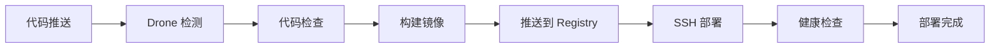

# Gitea + Drone CI/CD 配置指南

## 1. 前置要求

### 服务器环境

- Gitea: `http://192.168.0.105:3000`
- Drone CI 服务
- Docker Registry (可选): `192.168.0.105:5000`
- 部署服务器: `192.168.0.105`

### 必需组件

- Docker & Docker Compose
- Git
- 网络连通性

## 2. Drone 配置

### 2.1 创建 Drone Secrets

在 Drone 中配置以下 secrets：

```bash
# Docker Registry 认证
drone secret add your-org/asimoGo docker_username your_docker_username
drone secret add your-org/asimoGo docker_password your_docker_password

# SSH 部署认证
drone secret add your-org/asimoGo ssh_username your_ssh_username
drone secret add your-org/asimoGo ssh_password your_ssh_password

# 通知 Webhook (可选)
drone secret add your-org/asimoGo webhook_url your_notification_webhook
```

### 2.2 激活仓库

1. 在 Drone 界面中激活 `asimoGo` 仓库
2. 配置仓库设置：
   - ✅ Trusted
   - ✅ Protected (如果需要)

## 3. 服务器配置

### 3.1 创建部署目录

```bash
# 生产环境
sudo mkdir -p /opt/telegram-bot
sudo chown $USER:$USER /opt/telegram-bot

# 测试环境
sudo mkdir -p /opt/telegram-bot-staging
sudo chown $USER:$USER /opt/telegram-bot-staging

# 备份目录
sudo mkdir -p /opt/backups/telegram-bot
sudo chown $USER:$USER /opt/backups/telegram-bot
```

### 3.2 部署配置文件

将以下文件复制到服务器：

```bash
# 生产环境
scp docker-compose.prod.yml user@192.168.0.105:/opt/telegram-bot/
scp .env.example user@192.168.0.105:/opt/telegram-bot/
scp deploy-server.sh user@192.168.0.105:/opt/telegram-bot/

# 测试环境
scp docker-compose.ci.yml user@192.168.0.105:/opt/telegram-bot-staging/
scp .env.example user@192.168.0.105:/opt/telegram-bot-staging/
```

### 3.3 配置环境变量

```bash
# 在服务器上编辑 .env 文件
cd /opt/telegram-bot
cp .env.example .env
nano .env  # 填入实际的配置值
```

## 4. CI/CD 流程说明

### 4.1 自动触发条件

- **开发分支 (develop)**: 推送代码 → 构建 → 部署到测试环境
- **主分支 (main)**: 推送代码 → 构建 → 部署到生产环境
- **Pull Request**: 代码检查和构建测试

### 4.2 部署流程



### 4.3 流程步骤详解

1. **代码分析**: 检查 TypeScript 语法，构建项目
2. **安全扫描**: 使用 Trivy 扫描安全漏洞
3. **镜像构建**: 构建 Docker 镜像并推送到 Registry
4. **自动部署**: SSH 到服务器执行部署脚本
5. **健康检查**: 验证服务启动状态
6. **通知**: 发送部署结果通知

## 5. 手动部署

### 5.1 本地部署

```bash
# 开发环境
./deploy.sh dev

# 生产环境
./deploy.sh prod
```

### 5.2 服务器部署

```bash
# SSH 到服务器
ssh user@192.168.0.105

# 手动部署
cd /opt/telegram-bot
./deploy-server.sh deploy production latest

# 查看状态
./deploy-server.sh status

# 清理旧镜像
./deploy-server.sh cleanup
```

## 6. 监控和维护

### 6.1 查看日志

```bash
# 查看容器日志
docker logs -f telegram_bot

# 查看 Docker Compose 日志
docker-compose -f docker-compose.prod.yml logs -f
```

### 6.2 健康检查

```bash
# 手动健康检查
curl http://192.168.0.105:3000/health

# 容器内健康检查
docker exec telegram_bot curl -f http://localhost:3000/health
```

### 6.3 容器管理

```bash
# 重启服务
docker-compose -f docker-compose.prod.yml restart

# 更新镜像
docker-compose -f docker-compose.prod.yml pull
docker-compose -f docker-compose.prod.yml up -d

# 查看资源使用
docker stats telegram_bot
```

## 7. 故障排除

### 7.1 常见问题

1. **构建失败**: 检查 `.drone.yml` 配置和 secrets
2. **部署失败**: 检查 SSH 连接和服务器权限
3. **服务启动失败**: 检查环境变量和容器日志
4. **健康检查失败**: 检查端口和网络配置

### 7.2 回滚操作

```bash
# 查看镜像历史
docker images 192.168.0.105:5000/telegram-bot

# 回滚到指定版本
export IMAGE_TAG=previous_tag
docker-compose -f docker-compose.prod.yml up -d
```

## 8. 安全注意事项

1. **secrets 管理**: 所有敏感信息通过 Drone secrets 管理
2. **网络安全**: 限制服务器访问权限
3. **容器安全**: 使用非 root 用户运行容器
4. **镜像安全**: 定期更新基础镜像和依赖
5. **备份策略**: 定期备份配置和数据

## 9. 配置文件说明

- `.drone.yml`: Drone CI/CD 流水线配置
- `Dockerfile.ci`: CI/CD 专用的多阶段构建文件
- `docker-compose.ci.yml`: CI/CD 环境的容器编排
- `deploy-server.sh`: 服务器端自动部署脚本
- `.dockerignore`: Docker 构建时忽略的文件
